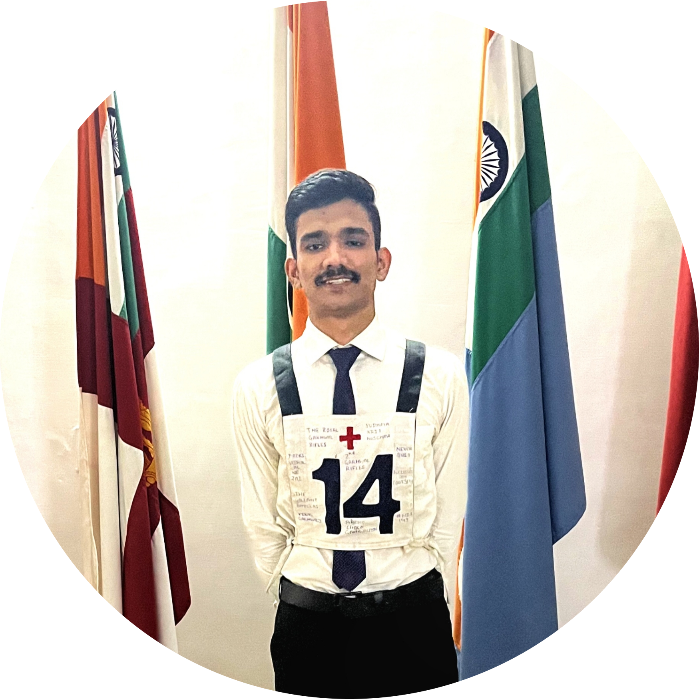
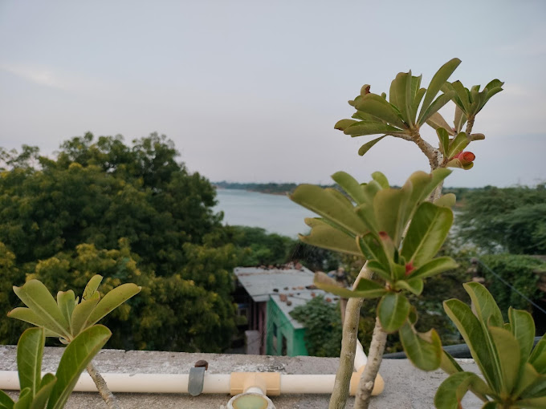
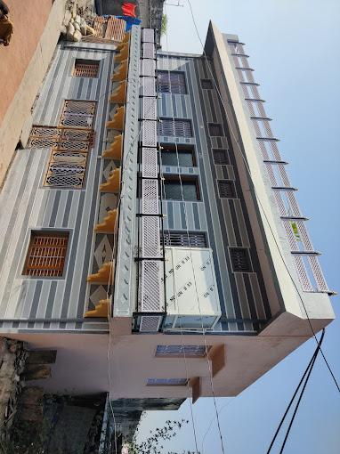
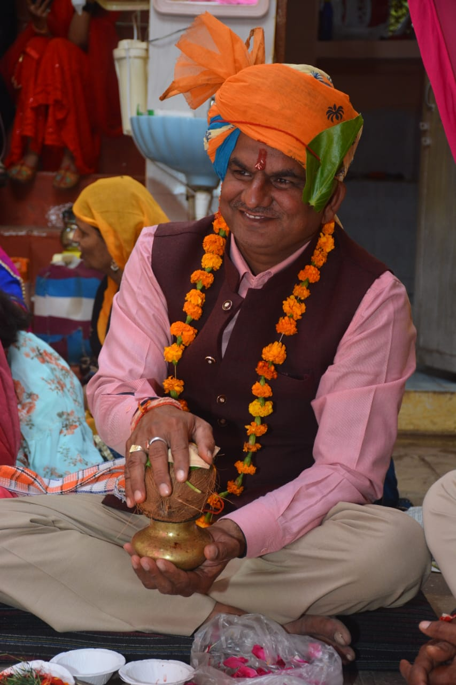
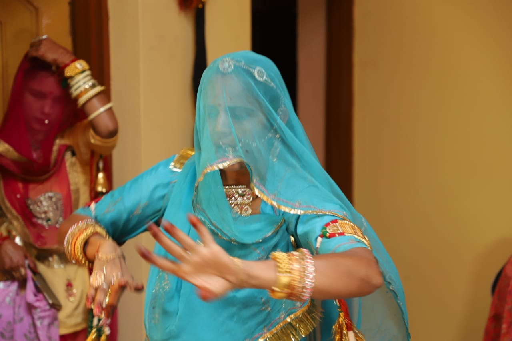

# cv
<!DOCTYPE html>
<html lang="en">
<head>
    <meta charset="UTF-8">
    <title> YASHVARDHAN SINGH HADA</title>
</head>
<body style="background-color:#BACDDB";>
<table cellspacing="15" cellpadding="10">
  <tr>
   <td rowspan="2"> </td>
 <td> <h3>YASHVARDHAN SINGH HADA</h3>S/0 Arjun Singh Hada. </td>
</tr>
  <tr>
    <td><h3><a href="https://www.upsc.gov.in/sites/default/files/FR-NDA1-2022-171122-ENG.pdf">UPSC NDA I 2022 AIR 182</a></h3>
 <h3>DEPARTMENT OF COMPUTER SCIENCE | CSE"25~CTAE UDAIPUR | NATIONAL CADET CORPS.</h3></td>
</table>

Welcome to the world of YASHVARDHAN SINGH HADA,here you get to know about him a lot about his carrer,education qualification,
    hobbies and interest,village and family.

<h3>EDUCATION QUALIFICATION</h3>

<table cellspacing="10">
  <thead>
    <th>INSTITUTE LOGO</th>
    <th>INSTITUTE NAME</th>
    <th>COURSE OPTED</th>
    <th>GRADES</th>
  </thead>
  <tr >
    <td></td>
    <td>CENTRAL ACADEMY SIKSHANTAR SENIOR SECONDARY SCHOOL</td>
    <td>10th & 12th(PCM)</td>
    <td>95.17% & 96.6%</td>
    </tr>  
    <tr>
    <td></td>
    <td>COLLEGE OF TECHNOLOGY & ENGINEERING</td>
    <td>B-TECH(CSE)</td>
    <td>7.64 GPA</td>
    </tr>
  </table>

<h3>HOBBIES AND INTEREST</h3>

<ul type="disc">
  <li>Geopolitics</li>
  <li>Map Reading & Creation</li>
  <li>Gymming</li>
  <li>Social Blogging</li> 
</ul>

<h3>VILLAGE:-THE HEAVEN</h3>

<table>
<tr>
  <td><a href="https://www.google.com/search?q=hada+niwas+thikana+notana&rlz=1C1UEAD_enIN1000IN1000&oq=hada+niw&aqs=chrome.1.69i57j35i39j0i512j0i22i30l3j0i390i650l2.8274j0j7&sourceid=chrome&ie=UTF-8#">   VILLAGE VIEW</a></td>
<td> HOME</td>
</tr></table>

<h3> FAMILY MEMBER</h3>

<table cellspacing="10">
  <thead>
    <th>PHOTOGRAPH</th>
    <th>NAME</th>
    <th>TWO WORDS REMARKS</th>
  </thead>
  <tr>
    <td></td>
    <td>SHRI ARJUN SINGH HADA</td>
    <td>REAL MEN</td>
  </tr>
  <tr>
    <td></td>
    <td>SHRIMATI RANU KANWAR HADA</td>
    <td>LIVING GOD</td>
  </tr>
  <tr>
    <td></td>
    <td>KU. HARSHVARDHAN SINGH HADA</td>
    <td>NO COMPETITION</td>
  </tr>

</table>

<h3>CONTACT DETAILS</h3>

Contact Number: 9587314897 
Email: hadayashvardhan@gmail.com 
ig: bana_yash_vardhan_singh_hada 

<h3>#MERE_GAON_AAOGE</h3>

<form>
  <feildset>
    <label>Fill Details</label>
   
     
     
    Name: <input type="text"  name="name" placeholder="enter your name here" required="" autofocus="" maxlength="20"  />
     
     
    Address:<textarea>street/area/areacode</textarea>
     
     
    Gender:<input type="radio" value="M" name="gender" checked=""/>Male    <!--nsame is used to give one choice either male or female-->
    Gender:<input type="radio" value="F" name="gender"/>Female
    Gender:<input type="radio" value="O" name="gender"/>Other
     
     
    Email:<input type="email" name="email"/>
     
     
    Password:<input type="password" name="password"/>
     
     

    Country:<select>
        <option>Please select a Country</option>
        <optgroup label="ASIA"> 
        <option value="India">India</option>
        <option value="Srilanka">Srilanka</option>
        </optgroup>
        <option value="USA">USA</option>
         
         
        <input type="submit" name="Send"/>
    </select>
     

  </feildset>
  </form>

</body>
</html>
